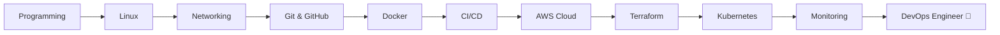

<p align="center">

</p>
<div align="center">


<p align="center">

</p>

<br>

<a href="https://www.linkedin.com/in/vikas0905/">

</a>

<a href="mailto:vikash76518@gmail.com">

</a>

<a href="http://code-editor-2078023735.ap-northeast-1.elb.amazonaws.com/">

</a>

<br><br>


</div>

# 🐍 Contribution Snake

<p align="center">
  
</p>


---

# 💫 About Me


```yaml
Name: Vikas Kumar

Location: Indore, India

Education:
  - B.Tech Information Technology

Role:
  - Full Stack Developer
  - Cloud Engineer
  - DevOps Enthusiast

AWS Certifications:
  - AWS Certified Cloud Practitioner
  - AWS Certified Solutions Architect Associate
  - AWS Certified Developer Associate
  - AWS Certified AI Practitioner

Currently Building:
  - Cloud Native Applications
  - Real-Time Developer Tools
  - Full Stack Projects

Currently Learning:
  - Kubernetes
  - Terraform
  - CI/CD Pipelines
  - System Design
  - Cloud Architecture

Mission:
  - Build → Deploy → Scale → Automate
````

---

# ☁️ Cloud Journey

```text
Localhost
   ↓
Docker
   ↓
Amazon ECR
   ↓
Amazon ECS Fargate
   ↓
Application Load Balancer
   ↓
Production 🚀
```

---

# 🚀 Featured Project

## ⚡ CodeSync

### Real-Time Collaborative Code Editor

✨ Multiple Users Collaboration

✨ Live Code Synchronization

✨ Monaco Editor Integration

✨ Dockerized Infrastructure

✨ AWS ECS Fargate Deployment

✨ Application Load Balancer

🌍 Live Demo

<a href="http://code-editor-2078023735.ap-northeast-1.elb.amazonaws.com/">

</a>

---

# 🛠 Tech Stack

<div align="center">


</div>

---

# ☁️ AWS Certifications

<div align="center">


</div>

---

# 🚀 DevOps Roadmap



### 🛤 My Journey

```text
✅ JavaScript

✅ React.js

✅ Node.js

✅ Linux

✅ Git & GitHub

✅ Docker

✅ AWS

━━━━━━━━━━━━━━━━━━━

🔄 Currently Learning

⚙️ CI/CD Pipelines

☁️ Cloud Architecture

━━━━━━━━━━━━━━━━━━━

🎯 Next Goals

📦 Terraform

☸️ Kubernetes

📊 Prometheus

📈 Grafana

🔍 ELK Stack

━━━━━━━━━━━━━━━━━━━

🚀 Target

Cloud Engineer

DevOps Engineer

Platform Engineer
```

---

# 🏅 Achievements

🏆 AWS Certified (4x)

🚀 Successfully Deployed CodeSync on AWS ECS Fargate

☁️ Built End-to-End Cloud Deployment Pipeline

🐳 Dockerized Full Stack Applications

👨‍💻 President – DevOps & Open Source Club (DOSC)

🎓 B.Tech Information Technology

---

# 📊 GitHub Analytics

<div align="center">


</div>

---

# 🔥 GitHub Streak

<div align="center">


</div>

---

# 📈 Contribution Activity

<div align="center">


</div>

---

# 🏆 GitHub Trophies

<p align="center">


</p>

---

# 🎯 2026 Goals

✅ Kubernetes

✅ Terraform

✅ CI/CD Pipelines

✅ Cloud Monitoring

✅ AWS Professional Certifications

✅ Open Source Contributions

✅ System Design

---

# 💭 Engineering Philosophy

> Building software is important.
>
> Deploying, scaling, monitoring and maintaining it is engineering.

---

# ⚡ Fun Fact

```text
Most developers stop after building.

I enjoy the second half:

Build → Containerize → Deploy → Scale 🚀
```

---

<div align="center">


</div>

---

<div align="center">

### ☁️ Turning Ideas Into Scalable Cloud Systems 🚀


</div>
